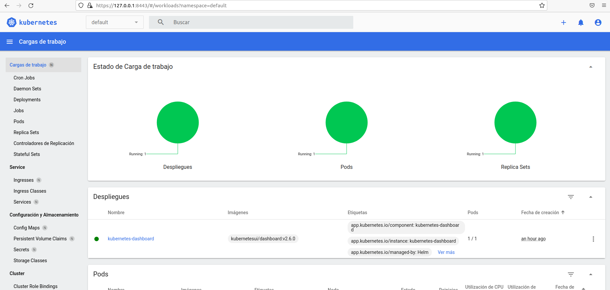
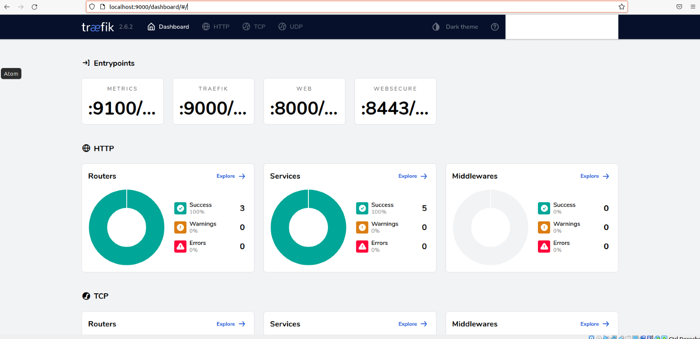

# Description
Install kubernetes k3s in Ubuntu 20.04 with Kubernetes Dashboard using helm

## Install k3s by default like services
```shell
curl -sfL https://get.k3s.io | sh -
```

Check installation
```shell
kubectl get nodes

NAME             STATUS   ROLES                  AGE   VERSION
k3s-virtualbox   Ready    control-plane,master   16h   v1.23.8+k3s1
```

## Configure kubectl without sudo privileges
Copy the context to your ~/.kube/config and set this config as the default.

```shell
sudo cp /etc/rancher/k3s/k3s.yaml ~/.kube/config &&
sudo chown $USER ~/.kube/config &&
chmod 600 ~/.kube/config &&
export KUBECONFIG=~/.kube/config
```

You probably want to store that export to your bashrc or bash_profile. After you changed this you can use kubectl in a new terminal.

## install helm
```shell
curl -fsSL -o get_helm.sh https://raw.githubusercontent.com/helm/helm/main/scripts/get-helm-3
chmod 700 get_helm.sh
./get_helm.sh
```

## install kubernetes dashboard
Add kubernetes dashboard repository
```shell
helm repo add kubernetes-dashboard https://kubernetes.github.io/dashboard/
```

install kubernetes dashboard
```shell
helm install kubernetes-dashboard kubernetes-dashboard/kubernetes-dashboard
```

## Resolve the service account errors in dashboard
Create a service service account from yaml
```shell
kubectl create -f sa_cluster_admin.yaml
```

Describe service account created and get tokens name
```shell
kubectl -n kube-system describe sa dashboard-admin

Name:                dashboard-admin
Namespace:           kube-system
Labels:              <none>
Annotations:         <none>
Image pull secrets:  <none>
Mountable secrets:   dashboard-admin-token-rmlhr
Tokens:              dashboard-admin-token-rmlhr
Events:              <none>

```

Discover token created for this service account
```shell
kubectl -n kube-system describe secret dashboard-admin-token-rmlhr

Name:         dashboard-admin-token-rmlhr
Namespace:    kube-system
Labels:       <none>
Annotations:  kubernetes.io/service-account.name: dashboard-admin
              kubernetes.io/service-account.uid: c038e687-d4ca-4b74-a26a-83234ee24675

Type:  kubernetes.io/service-account-token

Data
====
ca.crt:     570 bytes
namespace:  11 bytes
token:      eyJhbGciOiJSUzI1NiIsImtpZCI6IjUwX2lqNFY2M3VIUGxuSzZGMzh1dG1KT0JISGlFMVdHTWVISUs3Tl9zNm8ifQ.eyJpc3MiOiJrdWJlcm5ldGVzL3NlcnZpY2VhY2NvdW50Iiwia3ViZXJuZXRlcy5pby9zZXJ2aWNlYWNjb3VudC9uYW1lc3BhY2UiOiJrdWJlLXN5c3RlbSIsImt1YmVybmV0ZXMuaW8vc2VydmljZWFjY291bnQvc2VjcmV0Lm5hbWUiOiJkYXNoYm9hcmQtYWRtaW4tdG9rZW4tcm1saHIiLCJrdWJlcm5ldGVzLmlvL3NlcnZpY2VhY2NvdW50L3NlcnZpY2UtYWNjb3VudC5uYW1lIjoiZGFzaGJvYXJkLWFkbWluIiwia3ViZXJuZXRlcy5pby9zZXJ2aWNlYWNjb3VudC9zZXJ2aWNlLWFjY291bnQudWlkIjoiYzAzOGU2ODctZDRjYS00Yjc0LWEyNmEtODMyMzRlZTI0Njc1Iiwic3ViIjoic3lzdGVtOnNlcnZpY2VhY2NvdW50Omt1YmUtc3lzdGVtOmRhc2hib2FyZC1hZG1pbiJ9.HW4a6RNnb7zdTuLBjOJIUzAwW4gzrmkjYJDCX0XnZaD5YbmSkv1M8bd-Cc8JNkHVPqdeK090XpsYOsT2CFgPLcZGdMkQHR9lH_yhhIElkzAJdyQ7x3yuPQg4cMh_ZH6kzqfSacvfkakowTmuSq3Cd3kMqAujMRajJMN6qmK_R4HMZkhJ9akXPXAj1F3amtGpegCvfLn7KmwMK7dF7BYUpPbChqDxOZn_K3OoRMabiR5d82flyeZYyy8FZXmmC1fnWgFgNeG7bOKJ6AGN2sEUTA0cmq9ixsE2liQarI2YhapLR8ZEDeWP0B6NkF0OHK4_PHdSFT8H93QROEMJAbkflQ
```

## Connect to kubernetes Dashboard
Create a port forward to connect to kubernetes dashboard
```shell
export POD_NAME=$(kubectl get pods -n default -l "app.kubernetes.io/name=kubernetes-dashboard,app.kubernetes.io/instance=kubernetes-dashboard" -o jsonpath="{.items[0].metadata.name}")
kubectl -n default port-forward $POD_NAME 8443:8443
```

Connect to kubernetes dashboard and select token login
```shell
https://127.0.0.1:8443/
```



## Connect to traefik Dashboard

Create a port forward to connect to kubernetes dashboard
```shell
kubectl -n kube-system port-forward $(kubectl -n kube-system get pods --selector "app.kubernetes.io/name=traefik" --output=name) 9000:9000
```

Connect to traefik dashboard
```shell
http://127.0.0.1:9000/dashboard/
```



## Some Links
- https://0to1.nl/post/k3s-kubectl-permission/
- https://artifacthub.io/packages/helm/k8s-dashboard/kubernetes-dashboard
- https://www.virtualizationhowto.com/2021/06/kubernetes-dashboard-helm-installation-and-configuration/
